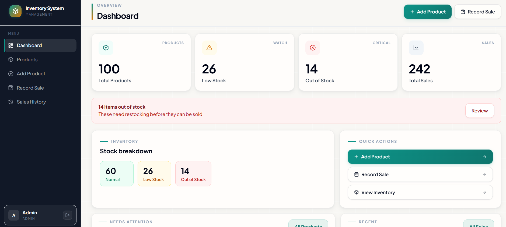
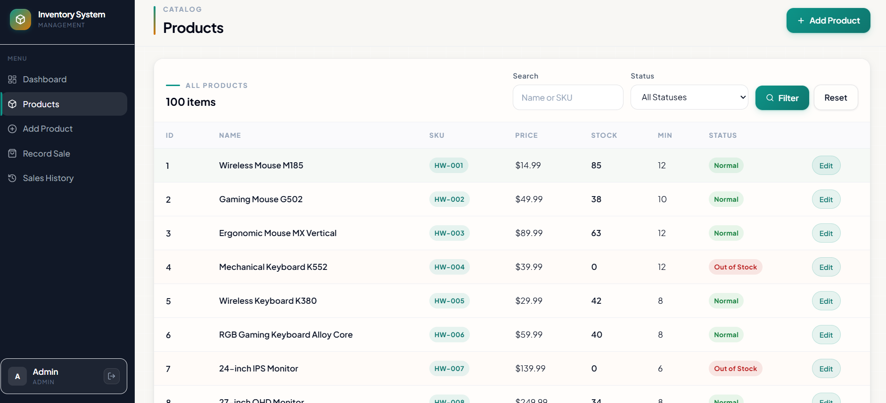
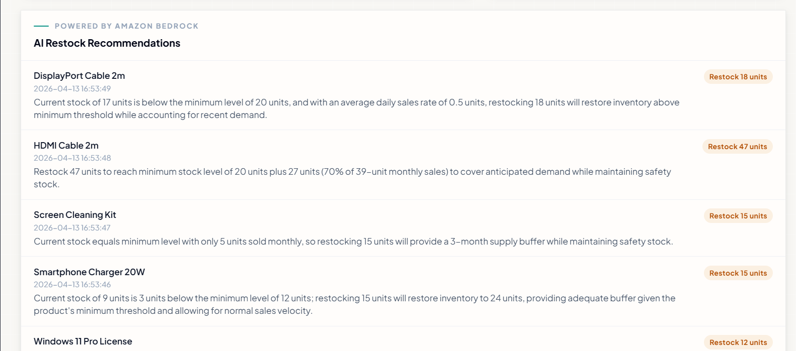
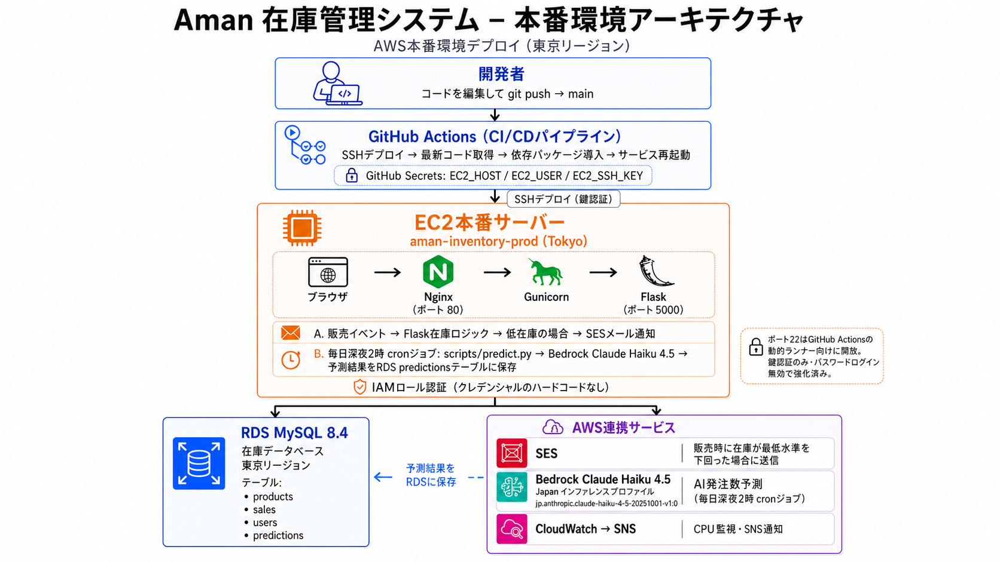

# 在庫管理システム

> 🇬🇧 English version → [README.md](README.md)

**AWS EC2 + RDS** 上に構築・デプロイしたFlask製在庫管理ダッシュボードです。**Amazon Bedrock AIによる発注数予測**、**SES低在庫メール通知**、**CloudWatch CPUモニタリング**、**IAMロール認証**（認証情報のハードコードなし）、**英日バイリンガルUI**、**GitHub Actions CI/CDパイプライン**を実装しています。

> **ライブデモ:** [http://35.77.96.153](http://35.77.96.153/login) | AWS EC2 · ap-northeast-1（東京）· HTTP（HTTPS対応予定）
> デモログイン: `demo@company.com` / `demo123`（読み取り専用の一般アカウント）

---

## 技術スタック

| レイヤー | 技術 |
| --- | --- |
| バックエンド | Python 3、Flask（Application Factory + Blueprints） |
| フロントエンド | Jinja2、AdminLTE 3、Bootstrap 4、Font Awesome |
| データベース | MySQL 8.4（AWS RDS：本番環境）/ SQLite（ローカル開発） |
| サーバー | Ubuntu 24 EC2 · Nginxリバースプロキシ · Gunicorn · systemd |
| AI / ML | Amazon Bedrock: Claude Haiku 4.5（Japan推論プロファイル） |
| 通知 | Amazon SES（低在庫メール）· CloudWatch + SNS（CPU警報） |
| CI/CD | GitHub Actions: `main`ブランチへのプッシュで自動デプロイ |
| 認証 | IAMロール（`inventory-ec2-ses-role`）: AWSクレデンシャルのハードコードなし |
| 多言語対応 | 英日バイリンガル: Flaskセッションベースの言語切り替え |

---

## 機能一覧

### コアアプリケーション

- セッション管理を用いた安全なログイン・ログアウト機能
- ダッシュボードに全商品数、低在庫数、在庫切れ数、総売上をまとめて表示
- **商品管理**: 追加・編集、商品名またはSKUによる検索、在庫状態によるフィルタリングに対応
- **売上管理**: 売上登録時に在庫を自動減算し、過剰販売を防止するバリデーション付き
- 検索・日付範囲フィルタリングに対応した売上履歴
- すべての入力項目にサーバーサイドバリデーションを実装
- 在庫ステータスはリアルタイムで動的に算出
- **バイリンガルUI（英/日）**: Flaskセッションで言語設定を保持。全UIテキスト、フラッシュメッセージ、在庫ステータスラベルを選択中の言語で表示
- **ロールベースアクセス制御**: `admin_required`デコレータで商品追加・編集・売上登録ルートを管理者のみに制限。一般アカウントは読み取り専用とし、管理者向けUIボタンは非表示

### AWSサービス連携

- **Amazon SES**: 売上登録により`stock_quantity`が`minimum_stock_level`を下回った際に、低在庫メールアラートを自動送信
- **CloudWatch Alarm**: EC2のCPU使用率を監視し、1分間連続で80%を超えた場合にSNSメールを送信
- **Amazon Bedrock（Claude Haiku 4.5）**: 毎日午前2時（EC2時刻）にcronジョブが起動。低在庫商品を取得し、各商品の過去30日間の売上履歴をもとにBedrockへリクエスト。`recommended_restock_qty`（推奨発注数）と理由を英日両言語で生成し、`predictions`テーブルに保存してダッシュボードに表示

---

## スクリーンショット

### ダッシュボード



### 商品在庫一覧



### AI発注推奨（Amazon Bedrock）



---

## アーキテクチャ

AWS東京リージョン上に、EC2、RDS MySQL、GitHub Actions CI/CD、IAMロール認証、SES通知、CloudWatch監視、Amazon BedrockによるAI発注数予測を組み合わせて本番環境を構築しています。



---

## 開発中に直面した課題と解決策

**Bedrock推論プロファイル**: ap-northeast-1ではモデルIDを直接指定するとクロスリージョン推論が失敗する。標準モデル文字列ではなく、Japan推論プロファイルID（`jp.anthropic.claude-haiku-4-5-20251001-v1:0`）を使用することで解決。

**バイリンガルAI予測**: UIを日本語に切り替えてもBedrockのレスポンスが英語で返される問題が発生。原因はlocalStorageのみで管理されていたフロントエンド限定の言語切り替え処理。`/set-lang/<lang>`ルートをFlaskに追加し、サーバーサイドセッションに言語を保存することで、Bedrockレスポンスを正しい言語で取得・表示できるよう修正。

**CI/CDとポート22の制約**: GitHub ActionsのランナーはAzureの動的IPを使用するため、SSH接続のIPホワイトリスト運用が現実的でない。セキュリティグループでポート22を`0.0.0.0/0`に開放し、OSレベルでパスワード認証を無効化・鍵認証のみに制限することで対応（`sshd_config`で設定）。

**Gunicornのファクトリパターン**: `if __name__ == '__main__':`内の`app = create_app()`はGunicornからアクセスできない。ファクトリ呼び出し形式（`gunicorn "app:create_app()"`）に変更することで解決。

---

## データベーススキーマ

```
products     — id, name, sku, price, stock_quantity, minimum_stock_level, created_at, updated_at
sales        — id, product_id, quantity_sold, sale_date
users        — id, name, email, password_hash, role, created_at
predictions  — id, product_id, recommended_restock_qty, reasoning, reason_en, reason_ja, predicted_at
```

**在庫ステータスの判定ロジック:**

- `在庫切れ` → `stock_quantity == 0`
- `低在庫` → `stock_quantity <= minimum_stock_level`
- `正常` → `stock_quantity > minimum_stock_level`

**売上登録のトランザクションフロー:**

1. ユーザーが商品と数量を選択
2. システムが利用可能在庫を検証
3. 在庫が十分な場合: 売上レコードを登録し、`stock_quantity`をアトミックに減算
4. 在庫が不足している場合: エラーを返し、データ変更なし

---

## プロジェクト構成

```
inventory-system/
├── .github/
│   └── workflows/
│       └── deploy.yml         # GitHub Actions CI/CD
├── database/
│   ├── client.py              # DB抽象化レイヤー（ローカル開発用SQLite対応）
│   ├── schema.sql             # MySQLスキーマ（本番環境）
│   └── schema_sqlite.sql      # SQLiteスキーマ（ローカル開発）
├── logs/
│   └── predict.log            # Bedrock cronジョブの出力ログ
├── models/
│   ├── product.py             # 商品CRUD + 在庫ステータスロジック
│   ├── sale.py                # 売上登録 + 在庫減算
│   └── user.py                # ユーザー検索 + パスワードハッシュ
├── routes/
│   ├── auth.py                # ログイン、ログアウト、/set-lang/ルート、@login_required
│   ├── dashboard.py           # ダッシュボード統計 + AI予測
│   ├── products.py            # 商品CRUDルート
│   └── sales.py               # 売上登録・履歴ルート
├── scripts/
│   ├── init_db.py             # DB初期化 + 管理者ユーザー作成
│   ├── import_csv.py          # CSVバルクインポート（商品100件、売上240件）
│   └── predict.py             # Bedrock AI発注予測（毎日cronジョブ、バイリンガル）
├── static/
│   ├── css/style.css
│   └── js/
│       ├── app.js
│       └── i18n.js            # 英日言語切り替え（/set-lang/ルートを呼び出し）
├── templates/
│   ├── base.html              # AdminLTEシェル（サイドバー + ナビバー）
│   ├── dashboard.html         # AI発注推奨付きダッシュボード（バイリンガル）
│   ├── login.html
│   ├── products/              # 一覧・追加・編集テンプレート
│   └── sales/                 # 売上登録・履歴テンプレート
├── utils/
│   └── email_alerts.py        # SES低在庫アラートヘルパー
├── .env.example
├── .gitignore
├── app.py                     # Flaskエントリーポイント（ファクトリパターン）
├── config.py                  # .envから設定を読み込み
└── requirements.txt
```

---

## ローカル開発環境のセットアップ

### 1. クローンと仮想環境の作成

```bash
git clone https://github.com/amanrai00/inventory-system.git
cd inventory-system
python -m venv venv

# Windows
.\venv\Scripts\Activate.ps1

# macOS / Linux
source venv/bin/activate

pip install -r requirements.txt
```

### 2. 環境変数の設定

```bash
cp .env.example .env
```

ローカル開発用のデフォルト設定（SQLite使用、MySQLのセットアップ不要）:

```
DB_BACKEND=sqlite
SQLITE_PATH=instance/inventory.db
FLASK_DEBUG=1
SECRET_KEY=replace_with_a_real_secret_key
```

### 3. データベースの初期化

```bash
python scripts/init_db.py
```

### 4. 起動

```bash
python app.py
# http://127.0.0.1:5000/login をブラウザで開く
```

**ローカルデフォルトログイン:** `admin@company.com` / `admin123`（`init_db.py`で作成; 実運用前に必ず変更してください）
**ライブデモ:** `demo@company.com` / `demo123`（読み取り専用の一般アカウント）

---

## 本番環境デプロイ（AWS）

| リソース | 詳細 |
| --- | --- |
| EC2インスタンス | `aman-inventory-prod`: Ubuntu 24、ap-northeast-1（東京） |
| RDSエンジン | MySQL Community 8.4.8、db.t4g.micro、ap-northeast-1（外部非公開; EC2セキュリティグループからのみアクセス可能） |
| WSGIサーバー | Gunicorn（ワーカー3台、ファクトリパターン） |
| プロセス管理 | systemd（`inventory.service`）: サーバー再起動後も自動的に起動 |
| リバースプロキシ | Nginx: ポート80からGunicornポート5000へ転送（内部のみ） |
| IAMロール | `inventory-ec2-ses-role`（SES + CloudWatch + Bedrock） |

GitHub Actions（`.github/workflows/deploy.yml`）が`main`ブランチへのプッシュを検知し、EC2へSSH接続、最新コードの取得、依存パッケージのインストール、Flaskサービスの再起動を自動実行します。

---

## EC2上の主要コマンド

```bash
# アプリの状態確認とリアルタイムログ
sudo systemctl status inventory
journalctl -u inventory -f

# 手動デプロイ
git pull origin main && pip install -r requirements.txt && sudo systemctl restart inventory

# AI予測の手動実行
cd ~/inventory-system && source venv/bin/activate && python3 scripts/predict.py
tail -50 logs/predict.log

# Nginx設定の確認とリロード
sudo nginx -t && sudo systemctl reload nginx

# CloudWatchアラームの手動テスト
aws cloudwatch set-alarm-state \
  --alarm-name "inventory-ec2-cpu-high" \
  --state-value ALARM \
  --state-reason "Manual test" \
  --region ap-northeast-1
```

---

## セキュリティ

- AWSクレデンシャルはハードコードせず、EC2はIAMロールで認証しています
- `.env`はgitignore済みのため、GitHubにプッシュされることはありません
- パスワードは`werkzeug.security`のPBKDF2でハッシュ化して保存しています
- 全ルートに`@login_required`を適用しており、書き込み操作には追加で`@admin_required`を適用しています
- ロールベースアクセス制御により、一般アカウント・デモアカウントは読み取り専用です。管理者向けUIはテンプレートレベルで非表示にし、ルートレベルでもアクセスをブロックしています
- ポート5000は外部に公開しておらず、すべてのトラフィックはNginx（ポート80）経由で処理します
- RDSセキュリティグループはMySQL（ポート3306）をEC2セキュリティグループからのみ許可しており、外部からの直接接続は許可していません
- SSH接続は鍵認証のみに制限しています（`sshd_config`でパスワード認証を無効化）。ポート22は、動的IPを使用するGitHub ActionsランナーのCI/CD対応のため`0.0.0.0/0`に開放しています

---

## 開発ロードマップ

- [x] Flask: Application Factory + Blueprints
- [x] SQLite（ローカル）+ MySQL（本番）デュアルバックエンド対応
- [x] EC2 + RDSデプロイ: 東京リージョン
- [x] Nginxリバースプロキシ
- [x] Gunicorn本番WSGIサーバー（ワーカー3台）
- [x] systemdプロセス管理（再起動後も自動起動）
- [x] GitHub Actions CI/CDパイプライン
- [x] Amazon SES低在庫メールアラート
- [x] CloudWatch EC2 CPUアラーム → SNSメール通知
- [x] Amazon Bedrock AI発注数予測（毎日cronジョブ、ダッシュボード表示）
- [x] CSVによる商品100件・売上240件のインポート
- [x] 英日バイリンガルUI: Flaskセッションによる言語切り替え
- [x] Bedrock予測の多言語対応（reason_en + reason_ja）
- [x] ロールベースアクセス制御（管理者 vs 一般社員）+ デモアカウント
- [ ] HTTPS / SSL証明書（Let's Encrypt、独自ドメイン取得が必要）
- [ ] S3を利用した商品画像アップロード
- [ ] 自動テストの整備

---

## ライセンス

本プロジェクトはポートフォリオおよび学習目的で制作しました。
