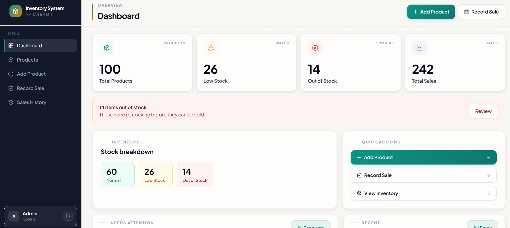
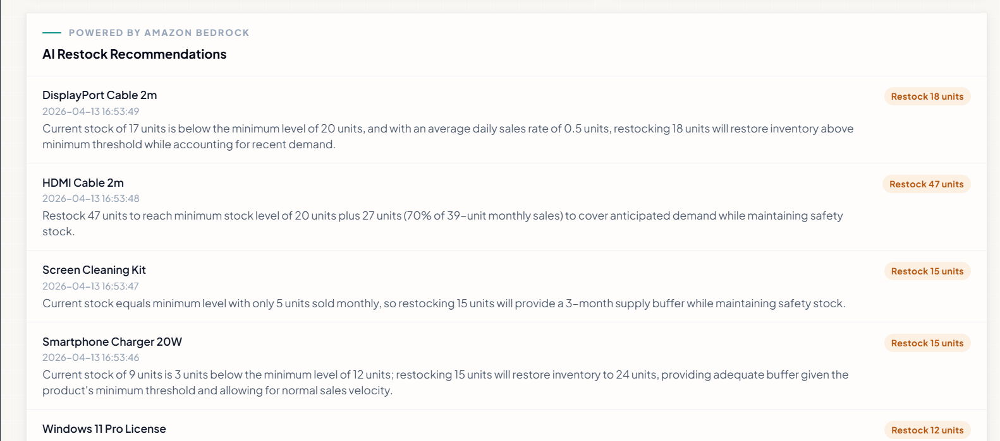
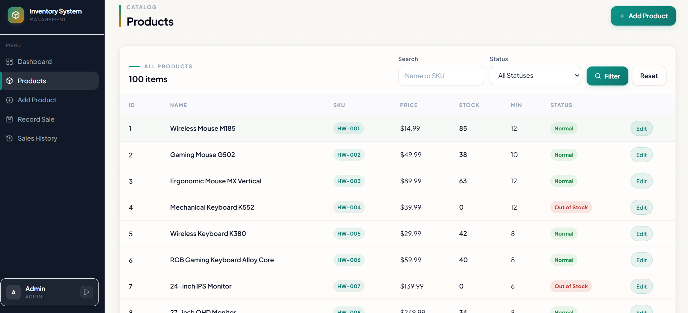
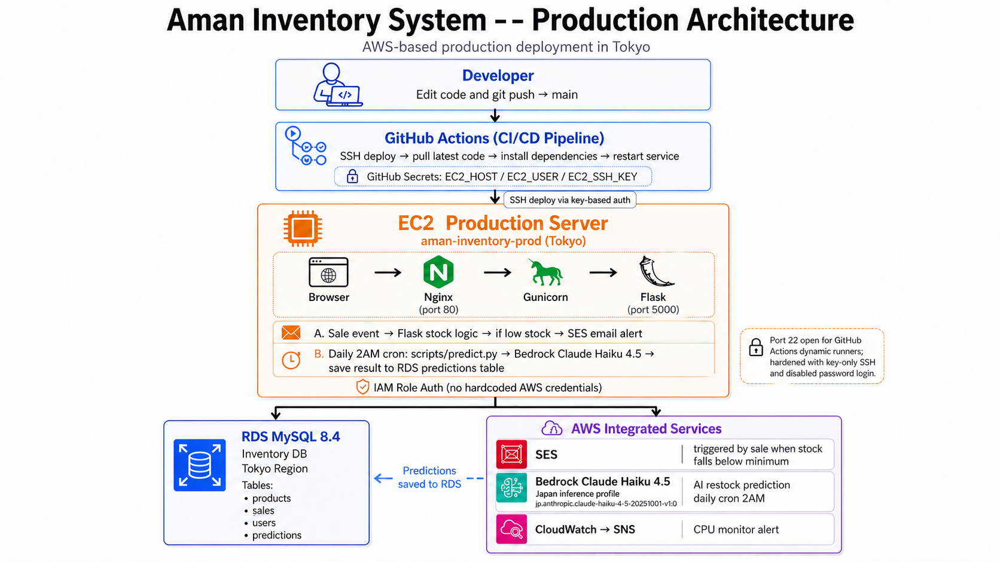

<div align="center">

# 在庫管理システム

### Amazon Bedrock AI による補充予測機能付き在庫管理ダッシュボード

[](http://35.77.96.153/login)
[](README.md)


---

**東京リージョンの AWS EC2 + RDS にデプロイした Flask アプリ。Amazon Bedrock が日次で英語・日本語両言語の補充推奨を生成。SES が在庫不足アラートを送信、CloudWatch が CPU を監視。GitHub Actions により `main` ブランチへの push ごとに自動デプロイ。**

</div>

---

## 🎯 ライブデモ

| | |
|---|---|
| **デモ URL** | [http://35.77.96.153/login](http://35.77.96.153/login) |
| **リージョン** | AWS ap-northeast-1（東京） |
| **デモログイン** | `demo@company.com` / `demo123`（読み取り専用） |

> デモは HTTP で稼働中。カスタムドメイン + Let's Encrypt による HTTPS 化はロードマップに記載。

---

## スクリーンショット

<table>
  <tr>
    <td align="center"><b>ダッシュボード</b></td>
    <td align="center"><b>AI 補充推奨</b></td>
  </tr>
  <tr>
    <td></td>
    <td></td>
  </tr>
  <tr>
    <td align="center"><b>商品在庫</b></td>
    <td align="center"><b>AWS 構成図</b></td>
  </tr>
  <tr>
    <td></td>
    <td></td>
  </tr>
</table>

---

## このシステムが解決すること

100 件以上の商品データを扱う中小企業が知りたいこと:

1. **今、何が在庫切れに近いか:** ダッシュボードに現在の在庫数とステータスを色分けで表示
2. **何を、どれだけ補充すべきか:** Amazon Bedrock（Claude Haiku 4.5）が商品ごとの過去 30 日分の販売履歴を読み込み、ユーザーの言語で補充数量と理由を毎日生成
3. **障害発生時の通知:** 在庫が閾値を下回った際に SES が管理者にメール送信、EC2 の CPU 使用率が閾値を超えた際に CloudWatch から SNS メール送信

すべて AWS 上で稼働、`git push` で自動デプロイ、IAM ロール認証を使用するため AWS キーをコードや環境変数に保存しません。

---

## アーキテクチャ

```
                    GitHub Actions (main へ push)
                              │
                              ▼ SSH デプロイ
   ┌──────────────────────────────────────────────┐
   │                EC2 (Ubuntu 24)               │
   │   Nginx :80  →  Gunicorn :5000  →  Flask     │
   │                       │                      │
   │              IAM Role（キー不要）              │
   └────┬───────────┬────────────┬────────────┬───┘
        │           │            │            │
        ▼           ▼            ▼            ▼
      RDS         Bedrock       SES       CloudWatch
     MySQL    Claude Haiku   メール       CPU アラーム
   (内部のみ)   (日次 cron)   アラート     → SNS
```

| 設計判断 | 理由 |
|---|---|
| **EC2 + Nginx + Gunicorn**（App Runner ではなく） | スタック全体を制御。AWS の基礎を一貫して習得 |
| **RDS は外部公開しない** | MySQL ポート 3306 は EC2 のセキュリティグループからのみ到達可能。インターネット非公開 |
| **EC2 IAM ロール**（アクセスキーではなく） | 漏洩・ローテーション・コミットの対象になる認証情報がゼロ |
| **Bedrock 推論プロファイル**（`jp.anthropic...`） | `ap-northeast-1` では標準モデル ID ではクロスリージョン推論が失敗 |
| **サーバーサイド言語切替**（localStorage ではなく） | Bedrock の予測はサーバー側でレンダリングするため、言語は Flask セッションで保持する必要あり |
| **ローカルは SQLite、本番は MySQL** | ローカル開発はゼロ設定、本番は実 DB エンジンを使用 |

---

## 技術スタック

| レイヤー | 技術 |
|---|---|
| バックエンド | Python 3.12、Flask（Application Factory + Blueprints） |
| フロントエンド | Jinja2、AdminLTE 3、Bootstrap 4 |
| データベース | MySQL 8.4（RDS / 本番）、SQLite（ローカル） |
| サーバー | Ubuntu 24 EC2、Nginx、Gunicorn（3 ワーカー）、systemd |
| AI / ML | Amazon Bedrock: Claude Haiku 4.5（JP 推論プロファイル） |
| アラート | Amazon SES（在庫不足）、CloudWatch + SNS（CPU） |
| CI/CD | GitHub Actions: `main` への push で自動デプロイ |
| 認証 | EC2 IAM ロール: AWS 認証情報をハードコードしない |
| i18n | Flask セッションベースの EN/JA 切替 |

---

## 主な機能

- **在庫 CRUD:** 商品の追加、編集、名称・SKU での検索、在庫ステータスでのフィルタ
- **販売記録:** 過剰販売を防ぐアトミックな在庫減算
- **AI 補充予測:** 日次 Bedrock cron ジョブが英語・日本語両言語の補充推奨を `predictions` テーブルに書き込み
- **在庫不足アラート:** 販売により商品が閾値を下回った際に SES がメール送信
- **CPU アラーム:** EC2 の CPU 使用率が 1 分間 80% を超えた際に CloudWatch + SNS でメール通知
- **バイリンガル UI:** UI 文字列、フラッシュメッセージ、Bedrock の理由文を含む完全な EN/JA 切替を Flask セッションで保持
- **ロールベースアクセス制御:** admin ロールは書き込み可能、employee/demo ロールは読み取り専用。admin UI はテンプレートとルートの両レベルで非表示
- **CI/CD:** `main` への push で GitHub Actions が EC2 に SSH 接続し、pull、依存解決、systemd ユニットの再起動を実行

---

## 開発中に解決した問題

実際に直面し、解決した問題を記載。それぞれ実際のデバッグ作業を伴いました。

**東京リージョンでの Bedrock 推論プロファイル。** 標準モデル ID `anthropic.claude-haiku-4-5-20251001-v1:0` で Bedrock を呼び出すと、`ap-northeast-1` でクロスリージョン推論エラーが返却されました。修正方法は日本推論プロファイル ID `jp.anthropic.claude-haiku-4-5-20251001-v1:0` の使用。Bedrock 推論プロファイルのドキュメント内で発見。モデル ID と推論プロファイル ID は表記が酷似していますが、クロスリージョン構成では挙動が異なります。

**バイリンガル AI 予測が英語のみ返却される問題。** UI を日本語に切り替えても Bedrock が英語で返答する状態。原因: 言語設定が `localStorage` のみに保存されており、Flask のダッシュボードルートが表示すべき言語を判別できなかったこと。修正: 言語をサーバーサイドセッションに保存する `/set-lang/<lang>` ルートを追加し、`predictions` テーブルに `reason_en` と `reason_ja` を両方保存することで、ダッシュボードが選択中の言語をレンダリング可能に。

**GitHub Actions ランナーの IP が動的。** ポート 22 を GitHub のランナー IP 範囲に許可リスト登録しようとしましたが、変更頻度が高く運用が困難。現状: セキュリティグループでポート 22 を `0.0.0.0/0` に開放、OS レベルでハードニング（パスワード認証無効、`sshd_config` で鍵ペア認証のみ）。理想的な構成ではないため、プライベートサブネット内のセルフホストランナーへの移行をロードマップに記載。

**Gunicorn と Factory パターン。** `if __name__ == '__main__':` の内側で `app = create_app()` を呼ぶと Gunicorn からアクセス不可。Factory を直接渡すことで解決: `gunicorn "app:create_app()"`。修正自体は単純ですが、エラーメッセージが原因を明示しないため特定に時間を要しました。

---

## データベーススキーマ

```
products      id, name, sku, price, stock_quantity, minimum_stock_level, created_at, updated_at
sales         id, product_id, quantity_sold, sale_date
users         id, name, email, password_hash, role, created_at
predictions   id, product_id, recommended_restock_qty, reasoning, reason_en, reason_ja, predicted_at
```

**在庫ステータス（毎回計算、保存しない）:**

- `OUT OF STOCK` → `stock_quantity == 0`
- `LOW STOCK` → `stock_quantity <= minimum_stock_level`
- `NORMAL` → `stock_quantity > minimum_stock_level`

**販売フロー（アトミック）:**

```
1. 在庫数を検証
2. sales レコード INSERT と products.stock_quantity UPDATE を 1 トランザクションで実行
3. 在庫不足の場合は処理を拒否、変更なし
4. コミット後に閾値チェック、下回っていれば SES アラート送信
```

---

## セキュリティ

- AWS 認証情報をコードや `.env` に保存しない。EC2 は IAM ロール `inventory-ec2-ses-role` を使用
- `.env` は gitignore 設定済み
- パスワードは PBKDF2（`werkzeug.security`）でハッシュ化
- すべてのルートに `@login_required`、書き込み系ルートには追加で `@admin_required`
- デモアカウントは読み取り専用。admin UI はテンプレートレベルで非表示、ルートレベルでブロック
- ポート 5000 は外部非公開。すべてのトラフィックは Nginx のポート 80 経由
- RDS のポート 3306 は EC2 セキュリティグループからのみ到達可能、インターネット公開なし
- SSH は鍵ペアのみ（`sshd_config` でパスワード認証無効化）

**ロードマップに記載中の既知の課題:**

- HTTP のみで稼働中（HTTPS 化にはカスタムドメインが必要、対応予定）
- SSH ポート 22 が `0.0.0.0/0` に開放（GitHub Actions のためのトレードオフ。セルフホストランナーへの移行予定）

---

## ローカル開発

```bash
git clone https://github.com/amanrai00/inventory-system.git
cd inventory-system
python -m venv venv

# Windows
.\venv\Scripts\Activate.ps1
# macOS / Linux
source venv/bin/activate

pip install -r requirements.txt
cp .env.example .env       # デフォルトは SQLite、MySQL のセットアップ不要
python scripts/init_db.py
python app.py              # http://127.0.0.1:5000/login
```

ローカルのデフォルトログイン（`init_db.py` でシード）: `admin@company.com` / `admin123`。実運用前に必ず変更してください。

---

## デプロイ構成

| リソース | 詳細 |
|---|---|
| EC2 | `aman-inventory-prod`、Ubuntu 24、ap-northeast-1 |
| RDS | MySQL 8.4.8、`db.t4g.micro`、外部公開なし |
| WSGI | Gunicorn（3 ワーカー、Factory パターン） |
| プロセス管理 | systemd（`inventory.service`、再起動時に自動復帰） |
| リバースプロキシ | Nginx ポート 80 から Gunicorn ポート 5000 へ |
| IAM | `inventory-ec2-ses-role`（SES + CloudWatch + Bedrock） |

GitHub Actions（`.github/workflows/deploy.yml`）が `main` への push ごとに、EC2 への SSH 接続、`git pull`、`pip install -r requirements.txt`、`systemctl restart inventory` を実行します。

<details>
<summary><b>EC2 でよく使うコマンド</b></summary>

```bash
# アプリの状態とライブログ
sudo systemctl status inventory
journalctl -u inventory -f

# 手動デプロイ
git pull origin main && pip install -r requirements.txt && sudo systemctl restart inventory

# AI 予測の手動実行
cd ~/inventory-system && source venv/bin/activate && python3 scripts/predict.py
tail -50 logs/predict.log

# Nginx
sudo nginx -t && sudo systemctl reload nginx

# CloudWatch アラームの手動テスト
aws cloudwatch set-alarm-state \
  --alarm-name "inventory-ec2-cpu-high" \
  --state-value ALARM \
  --state-reason "Manual test" \
  --region ap-northeast-1
```

</details>

---

## プロジェクト構成

<details>
<summary><b>クリックで展開</b></summary>

```
inventory-system/
├── .github/workflows/deploy.yml    # GitHub Actions CI/CD
├── database/
│   ├── client.py                   # DB 抽象化（SQLite/MySQL）
│   ├── schema.sql                  # MySQL スキーマ
│   └── schema_sqlite.sql           # SQLite スキーマ
├── models/
│   ├── product.py                  # 商品 CRUD と在庫ステータス
│   ├── sale.py                     # 販売記録と在庫減算
│   └── user.py                     # ユーザー検索とパスワードハッシュ
├── routes/
│   ├── auth.py                     # ログイン、ログアウト、/set-lang/<lang>
│   ├── dashboard.py                # 統計と AI 予測
│   ├── products.py
│   └── sales.py
├── scripts/
│   ├── init_db.py                  # DB 初期化と admin シード
│   ├── import_csv.py               # 一括インポート（商品 100 件、販売 240 件）
│   └── predict.py                  # Bedrock AI 予測（日次 cron、バイリンガル）
├── static/
│   ├── css/style.css
│   └── js/i18n.js                  # EN/JA 切替（/set-lang/ を呼ぶ）
├── templates/
│   ├── base.html                   # AdminLTE シェル
│   ├── dashboard.html              # AI 補充推奨
│   ├── products/
│   └── sales/
├── utils/email_alerts.py           # SES ヘルパー
├── app.py                          # Flask エントリーポイント（Factory パターン）
├── config.py                       # .env から読み込み
└── requirements.txt
```

</details>

---

## ロードマップ

**完了**

- [x] AWS デプロイ: EC2、RDS、Nginx、Gunicorn、systemd
- [x] CI/CD パイプライン: GitHub Actions による `main` への push 時自動デプロイ
- [x] AI 機能: Bedrock の日次補充予測、英語・日本語両言語の理由文
- [x] 運用: SES 在庫不足アラート、CloudWatch CPU アラーム → SNS
- [x] アクセス制御: ロールベース（admin/employee）、デモアカウント、IAM ロール認証
- [x] アーキテクチャ: Application Factory + Blueprints、デュアルバックエンド DB（SQLite/MySQL）
- [x] シードデータ: 商品 100 件 + 販売 240 件

**次に対応**

- [ ] 自動テストスイート（pytest、スモーク + 統合テスト）
- [ ] Let's Encrypt + カスタムドメインによる HTTPS 化
- [ ] セルフホスト GitHub Actions ランナー（プライベートサブネット内）
- [ ] S3 への商品画像アップロード

---

<div align="center">

### 開発者: [ライ アマン](https://www.linkedin.com/in/amanrai00) ／ 東京

**AWS 認定クラウドプラクティショナー（CLF-C02）取得済み** ・ SAA-C03 取得に向けて学習中 ・ クラウドエンジニア職を目指して構築中

[LinkedIn](https://www.linkedin.com/in/amanrai00) ・ [GitHub](https://github.com/amanrai00) ・ [AWS 認定バッジ](https://www.credly.com/badges/095a2b8e-c94f-4af6-b77c-51ec2fa64d56)

</div>
